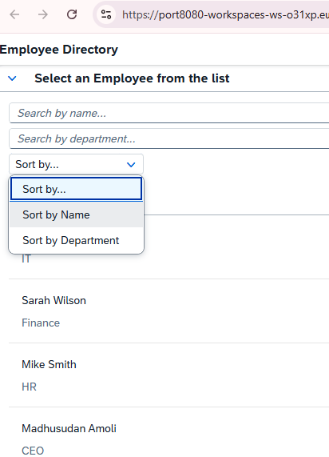
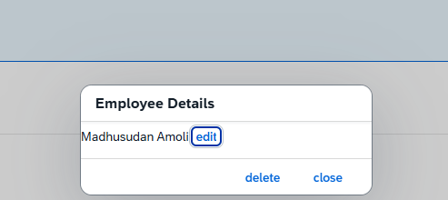

## Application Details
|               |
| ------------- |
|**Generation Date and Time**<br>Thu Jun 11 2026 05:13:03 GMT+0000 (Coordinated Universal Time)|
|**App Generator**<br>SAP Fiori Application Generator|
|**App Generator Version**<br>1.25.0|
|**Generation Platform**<br>SAP Business Application Studio|
|**Template Used**<br>Basic|
|**Service Type**<br>None|
|**Service URL**<br>N/A|
|**Module Name**<br>employee_directory|
|**Application Title**<br>Employee Directory|
|**Namespace**<br>student.com.sap.training.advancedsapui5|
|**UI5 Theme**<br>sap_horizon|
|**UI5 Version**<br>1.148.1|
|**Enable TypeScript**<br>False|
|**Add Eslint configuration**<br>True, see https://www.npmjs.com/package/@sap-ux/eslint-plugin-fiori-tools#rules for the eslint rules.|

## employee_directory

An SAP Fiori application.

### Starting the generated app

-   This app has been generated using the SAP Fiori tools - App Generator, as part of the SAP Fiori tools suite.  To launch the generated application, run the following from the generated application root folder:

```
    npm start
```

#### Pre-requisites:

1. Active NodeJS LTS (Long Term Support) version and associated supported NPM version.  (See https://nodejs.org)
# Employee Directory - SAPUI5 Learning Project

## Overview

Employee Directory is a SAPUI5 application developed as part of my SAP Fiori learning journey. The goal of this project is to gain practical experience with SAPUI5 concepts such as MVC architecture, data binding, JSON models, filtering, sorting, CRUD operations, and reusable UI components.

---

## Features

### Employee Management

* Display employee records using SAPUI5 controls
* Select employees and view details
* Add new employees
* Delete employees
* Update employee information (In Progress)

### Search & Filter

* Search employees by Name
* Search employees by Department
* Dynamic filtering using `sap.ui.model.Filter`

### Sorting

* Sort employee data using `sap.ui.model.Sorter`

### UI Components

* Responsive SAPUI5 layout
* Reusable Dialog Fragments
* Table-based employee details view

---

## SAPUI5 Concepts Practiced

### Models & Binding

* JSONModel
* Named Models
* One-Way Binding
* Two-Way Binding
* Binding Context

### MVC Architecture

* XML Views
* Controllers
* Event Handling

### Data Operations

* Filtering
* Sorting
* CRUD Foundations

### Development Tools

* SAP Business Application Studio
* Git & GitHub
* SAP Fiori Tools

---

## Technology Stack

| Technology   | Purpose                     |
| ------------ | --------------------------- |
| SAPUI5       | Frontend Framework          |
| JavaScript   | Application Logic           |
| XML Views    | UI Definition               |
| JSONModel    | Client-side Data Management |
| SAP BAS      | Development Environment     |
| Git & GitHub | Version Control             |

---

## Project Screenshots

### Employee Directory


### Search and Sort Functionality



### Add Employee Form


### Employee Details


### Dialog Fragment



---

## Learning Progress

### Completed

* JSONModel
* Data Binding
* Named Models
* Filtering
* Sorting
* Search Functionality
* CRUD Basics
* Dialog Fragments
* Git Integration


---

## Running the Application

```bash
npm install
npm start
```

---

## Author

**Madhusudan Amoli**

SAPUI5 / SAP Fiori Learning Repository

This project is continuously updated as I progress through SAPUI5 development and implement new concepts.
